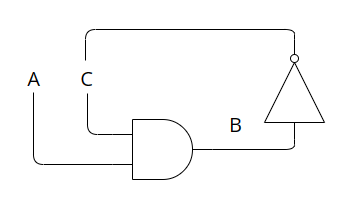
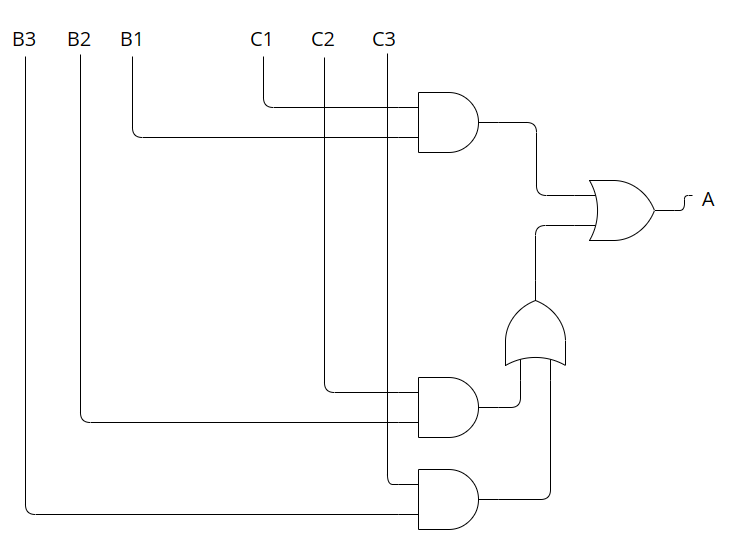

1. 
- 
- ______________________
- _ == LOW 0, - == HIGH 1

- A________|-----------------------------------
- B_____________|------------|____________|---
- C------------------|____________|-----------
- --------5-----8----10-----13----15-----18

2. 
```verilog
module SystemX(
    input wire A,
    input wire B,
    input wire C,
    input wire D,
    output wire Z
    );
    
    always @(A or B or C or D)
    begin
        wire n1, n2, n3, E, F;
        #5 n1 = A & B & C;
        #5 E = n1 | D;
        #5 n2 = !(B | C);
        #5 F = !(A & n2);
        #2 n3 = !F;
        #5 Z = (E | n3)&(!E | !n3);
    end
endmodule
```

3. 
- a 
```verilog
module SystemX(
    input integer C,
    input wire B1,
    input wire B2,
    input wire B3,
    output wire A
    );
    
    always @(B1 or B2 or B3 or C)
    begin
    if(C == 1)
        begin
            A = B1;
        end
    else if (C == 2)
        begin
            A = B2;
        end
    else if (C == 3)
        begin
            A = B3;
        end
    else
        begin
            A = 0;
        end
    end
endmodule
```


```verilog
module SystemX(
    input integer C,
    input wire B1,
    input wire B2,
    input wire B3,
    output wire A
    );
    
    assign A = C == 1? B1: C == 2? B2: C == 3? B3: 0;

endmodule
```
- 

4. 
- 
- 

5. 
 - a

```verilog
module LUT (
    input wire [2:0] address,
    output reg [1:0] SOP
);

reg [1:0] data [7:0];

initial begin
data[0] = 2'b11;
data[1] = 2'b11;
data[2] = 2'b10;
data[3] = 2'b00;
data[4] = 2'b01;
data[5] = 2'b01;
data[6] = 2'b10;
data[7] = 2'b01;
end

always @(address)
begin
    SOP = data[address];
  end
endmodule
```
 - b
```verilog
module LUT_4bit_1s (
    input wire [3:0] bits,
    output reg [2:0] count
);
reg [2:0] data [7:0];
initial begin
    data[0] = 3'd00;
    data[1] = 3'd01;
    data[2] = 3'd01;
    data[3] = 3'd02;
    data[4] = 3'd01;
    data[5] = 3'd02;
    data[6] = 3'd02;
    data[7] = 3'd03;
end

  always @(bits) begin
    count = data[bits];
  end

endmodule

```